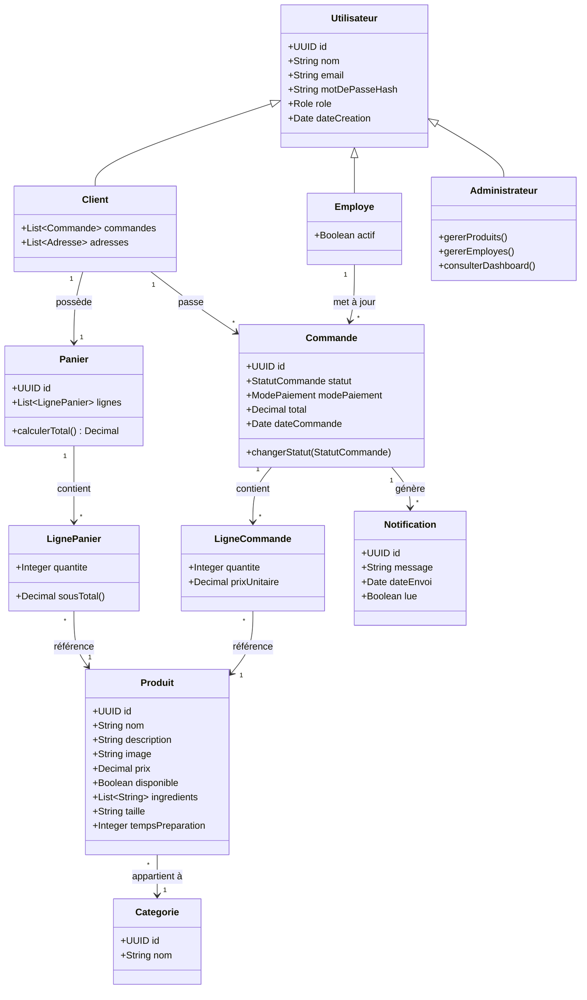
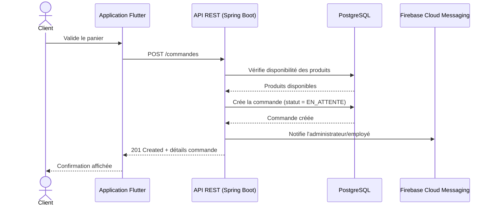
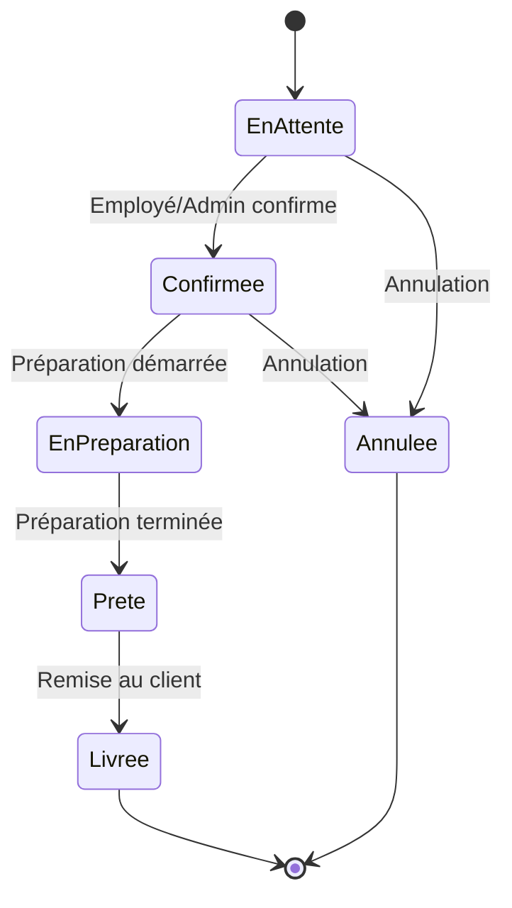
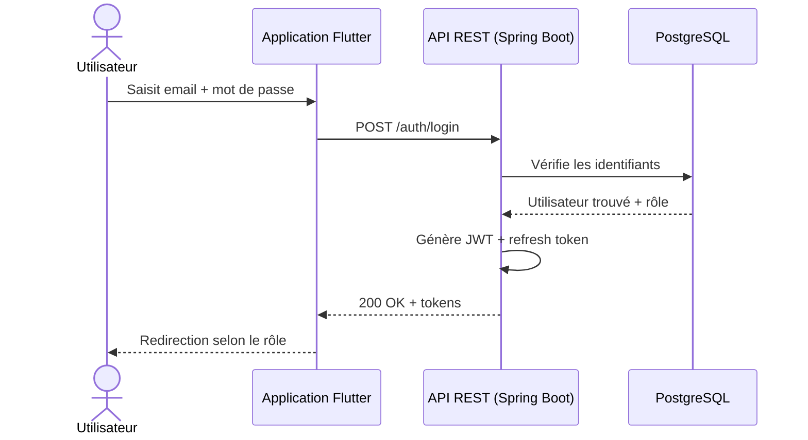

# Diagrammes UML — Fati's Corner

**Phase 5 — Diagrammes UML**
**Version :** 1.0
**Auteur :** Fatima
**Date :** Juillet 2026

Les diagrammes ci-dessous sont en syntaxe Mermaid — ils s'affichent directement dans GitHub (README, docs) et dans la plupart des éditeurs (VS Code avec l'extension Mermaid, GitLab, etc.).

---

## 1. Diagramme de classes

Modèle du domaine, basé sur le cahier des charges (Phase 1) et l'étude des besoins (Phase 2).

**Note :** le champ `modePaiement` de `Commande` inclut déjà les valeurs `MOBILE_MONEY_BANKILY` et `MOBILE_MONEY_MASRVI` dans l'énumération, même si leur intégration réelle est repoussée en évolution future (cf. cahier des charges §5.7).

---

## 2. Diagramme de séquence — Passer une commande (UC-06)

---

## 3. Diagramme d'état — Cycle de vie d'une commande (UC-11)

Chaque transition déclenche une notification Firebase vers le client (cf. US-20, UC-09).

---

## 4. Diagramme de séquence — Authentification (UC-02)

---

*Ces diagrammes servent de référence directe pour la Phase 6 (Architecture) et la Phase 7 (Base de données) — le diagramme de classes se traduit presque directement en schéma de tables.*
