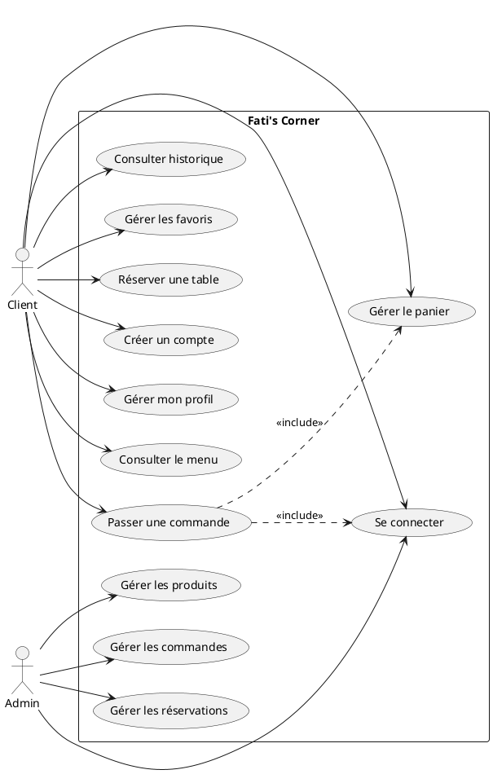
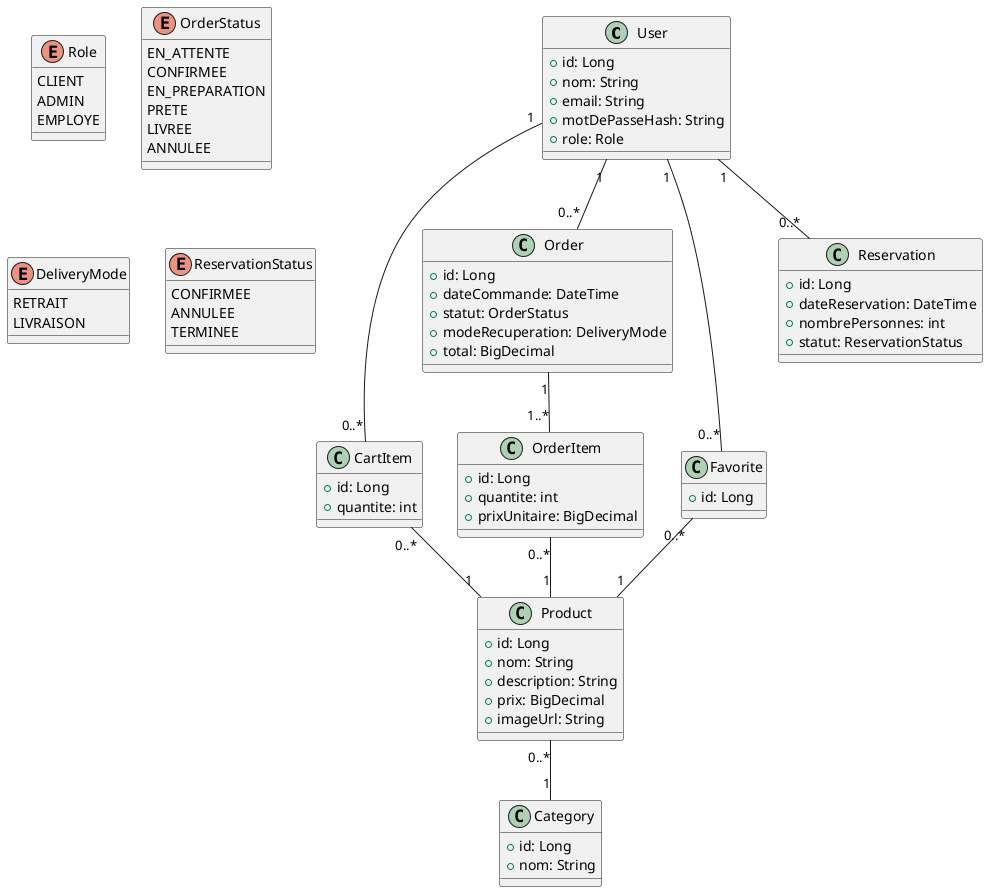
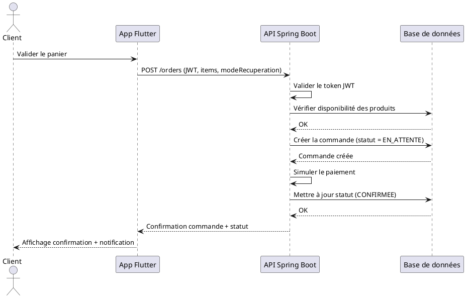
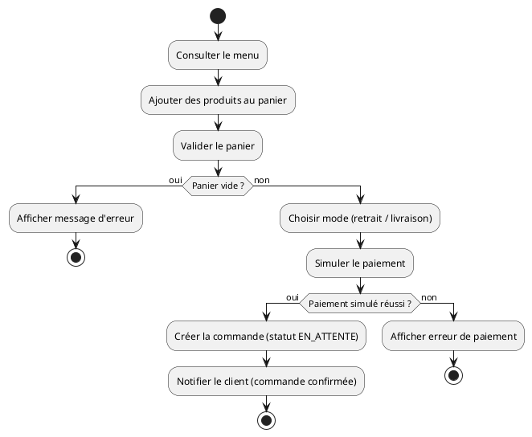
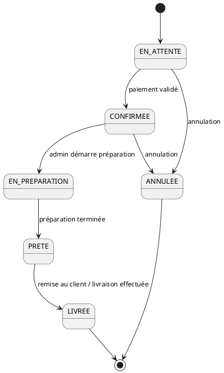
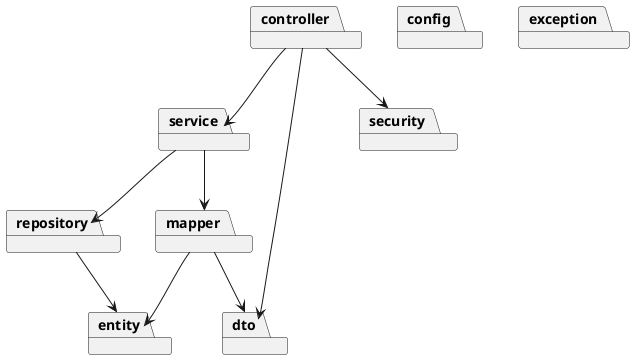

# 07 — UML
**Fati's Corner Documentation**

| | |
|---|---|
| **Projet** | Fati's Corner |
| **Version** | 1.0 — MVP |
| **Auteur** | Fatima (Fatoush) |
| **Basé sur** | 06-User-Stories.md |
| **Format** | PlantUML (texte → diagramme visuel) |

---

## 1. Introduction

Ce document contient les diagrammes UML modélisant le système Fati's Corner (MVP), au format **PlantUML**. Chaque bloc de code peut être collé dans [plantuml.com/plantuml](https://www.plantuml.com/plantuml/uml/) ou une extension VS Code (ex: "PlantUML" by jebbs) pour obtenir le rendu visuel.

> Les diagrammes **Composants** et **Déploiement**, plus liés à l'infrastructure technique, seront détaillés dans `08-Architecture.md` afin d'éviter la duplication.

---

## 2. Diagramme de cas d'utilisation (Use Case)

Basé directement sur les user stories de `06-User-Stories.md`.

---

## 3. Diagramme de classes (Class Diagram)

---

## 4. Diagramme de séquence (Sequence Diagram) — Passer une commande

---

## 5. Diagramme d'activité (Activity Diagram) — Passer une commande

---

## 6. Diagramme d'états (State Diagram) — Statut de la commande

---

## 7. Diagramme de packages (Package Diagram) — Backend

---

## 8. Notes de conception

- Les diagrammes **Composants** et **Déploiement** seront traités dans `08-Architecture.md`, car ils décrivent l'infrastructure technique (serveurs, conteneurs, services externes) plutôt que la logique métier
- Le rôle **EMPLOYE** apparaît déjà dans le modèle de classes (enum `Role`) conformément à la décision prise dans `05-Requirements.md`, même si aucun cas d'utilisation ne lui est encore associé
- Ces diagrammes serviront de base directe à la conception de la base de données (`09-Database.md`) et de l'architecture (`08-Architecture.md`)

---

*Ces diagrammes seront ajustés si des évolutions de conception apparaissent pendant le développement — toute modification significative devra être tracée dans `13-Decisions-Log.md`.*
