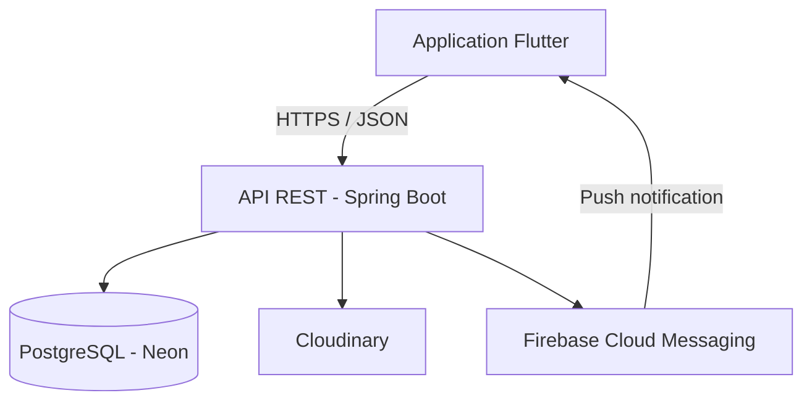
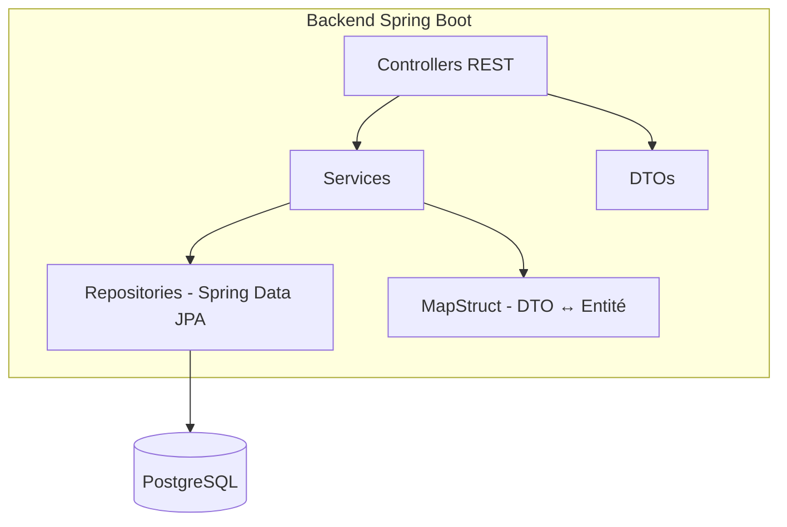
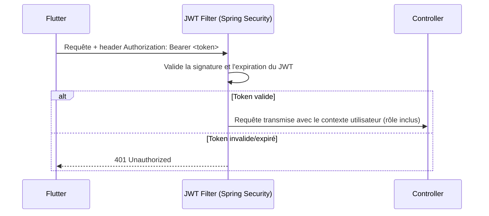

# Architecture du Projet — Fati's Corner

**Phase 6 — Architecture du projet**
**Version :** 1.0
**Auteur :** Fatima
**Date :** Juillet 2026

---

## 1. Vue d'ensemble

Architecture en couches, client-serveur, avec une API REST centrale consommée par l'application mobile Flutter.



- **Flutter** gère uniquement la présentation et les interactions utilisateur ; aucune logique métier côté client au-delà de la validation de formulaire basique.
- **Spring Boot** concentre toute la logique métier, la sécurité et l'accès aux données.
- **PostgreSQL (Neon)** est la source de vérité unique pour les données.
- **Cloudinary** stocke les images produits (hors base de données, seule l'URL est persistée).
- **Firebase Cloud Messaging** pousse les notifications vers l'appli sans que le client ait besoin de sonder l'API.

## 2. Architecture backend en couches



| Couche | Rôle |
|---|---|
| **Controller** | Expose les endpoints REST, reçoit/renvoie des DTOs, ne contient aucune logique métier |
| **Service** | Contient la logique métier (règles de gestion, validations, orchestration) |
| **Repository** | Accès aux données via Spring Data JPA, requêtes dérivées ou JPQL |
| **DTO / Mapper** | Sépare le modèle exposé à l'API du modèle de persistance (MapStruct pour la conversion) |
| **Entity** | Représentation des tables PostgreSQL via JPA/Hibernate |

Ce découpage garantit que la validation, la sécurité et les règles métier restent testables indépendamment de la base de données ou du framework web.

## 3. Sécurité — flux d'authentification



- Le rôle (`CLIENT`, `EMPLOYE`, `ADMIN`) est encodé dans le JWT et vérifié par `@PreAuthorize` sur chaque endpoint sensible.
- Le refresh token, plus longue durée de vie, permet de renouveler le JWT sans redemander les identifiants.
- CSRF n'est pas activé (cf. cahier des charges §6) puisque l'authentification est stateless par token, pas par cookie de session.

## 4. Structure des dossiers

```
fatis-corner/
├── backend/
│   ├── src/main/java/com/fatiscorner/
│   │   ├── controller/
│   │   ├── service/
│   │   ├── repository/
│   │   ├── entity/
│   │   ├── dto/
│   │   ├── mapper/
│   │   ├── security/
│   │   └── config/
│   └── src/main/resources/
│       └── application.yml
├── frontend/                  (application Flutter)
│   ├── lib/
│   │   ├── screens/
│   │   ├── widgets/
│   │   ├── models/
│   │   ├── services/          (appels API)
│   │   └── providers/         (gestion d'état)
│   └── pubspec.yaml
├── database/
│   └── migrations/
├── docs/
├── design/                    (maquettes Figma AI)
└── docker/
```

## 5. Environnements

| Environnement | Base de données | Notes |
|---|---|---|
| **Développement local** | PostgreSQL local ou branche Neon dédiée | Variables d'environnement dans `.env` / `application-dev.yml`, non versionnées |
| **Production** | PostgreSQL Neon (branche principale) | Secrets gérés via variables d'environnement du service d'hébergement |

## 6. Principes de conception de l'API REST

- Routes ressources au pluriel : `/products`, `/orders`, `/categories`
- Codes HTTP cohérents : `200` (succès), `201` (création), `400` (validation), `401` (non authentifié), `403` (non autorisé), `404` (introuvable)
- Pagination sur les listes volumineuses (`?page=0&size=20`)
- Documentation générée automatiquement via Swagger/OpenAPI, accessible en développement sur `/swagger-ui.html`

---

*Cette architecture sert de socle direct à la Phase 7 (Base de données) — les entités du diagramme de classes (Phase 5) se traduisent en tables PostgreSQL, et à la Phase 8 (API REST) pour la définition précise des endpoints.*
