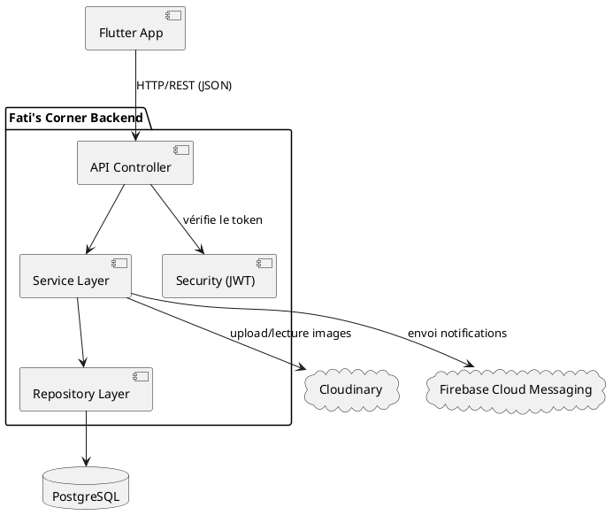
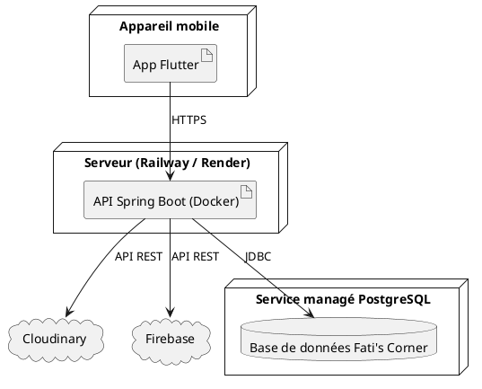

# 08 — Architecture
**Fati's Corner Documentation**

| | |
|---|---|
| **Projet** | Fati's Corner |
| **Version** | 1.0 — MVP |
| **Auteur** | Fatima (Fatoush) |
| **Basé sur** | 05-Requirements.md, 07-UML.md |

---

## 1. Introduction

Ce document décrit l'architecture technique globale de Fati's Corner : comment les différentes couches communiquent, comment le code est organisé, et comment le système est pensé pour rester maintenable et évolutif.

## 2. Vue d'ensemble

```
Flutter (Mobile)
      ↓  HTTP / REST (JSON)
API Spring Boot
      ↓
PostgreSQL (données)
      ↓
Cloudinary (images produits)
      ↓
Firebase Cloud Messaging (notifications push)
```

Le frontend Flutter ne communique **jamais directement** avec la base de données ou les services externes : tout passe par l'API Spring Boot, qui joue le rôle de point d'entrée unique et sécurisé.

## 3. Architecture backend — en couches

Le backend suit une **architecture en couches (layered architecture)**, un standard en entreprise qui sépare clairement les responsabilités :

```
Controller   → reçoit les requêtes HTTP, ne contient aucune logique métier
Service      → contient la logique métier
Repository   → accède à la base de données (via Spring Data JPA)
Entity       → représente les tables de la base de données
DTO          → objets utilisés pour échanger des données avec le client (jamais les entités directement)
Mapper       → convertit Entity ↔ DTO
Security     → gestion de l'authentification et des autorisations (JWT, Spring Security)
Configuration→ paramètres globaux de l'application
Exceptions   → gestion centralisée des erreurs
Utils        → fonctions utilitaires partagées
```

### 3.1 Pourquoi séparer Entity et DTO ?

C'est une bonne pratique essentielle : les entités reflètent la base de données (avec toutes ses relations internes), tandis que les DTO ne contiennent que ce qui doit réellement être envoyé au client. Cela évite d'exposer des informations sensibles (ex: mot de passe hashé) ou une structure interne inutile, et évite aussi les erreurs de sérialisation liées aux relations JPA.

### 3.2 Flux d'une requête (exemple : consulter le menu)

```
Client (Flutter) 
  → Controller (/api/products) 
  → Service (logique : filtrer produits actifs) 
  → Repository (requête SQL via JPA) 
  → Entity (Product) 
  → Mapper (Entity → DTO) 
  → Controller (retourne le DTO en JSON) 
  → Client
```

## 4. Diagramme de composants (Component Diagram)



## 5. Diagramme de déploiement (Deployment Diagram)



> En V1/MVP, le déploiement se fera probablement sur **Railway** ou **Render** (hébergement simple, gratuit ou peu coûteux, adapté à un projet étudiant) — le détail sera précisé dans `11-Deployment.md`.

## 6. Architecture frontend (Flutter)

```
lib/
├── core/          → constantes, thèmes, configuration globale
├── features/      → un dossier par fonctionnalité (auth, menu, cart, orders, favorites, reservation...)
├── widgets/        → composants UI réutilisables
├── services/       → appels API (ex: ProductService, OrderService)
├── repositories/   → couche d'abstraction entre services et UI
├── models/         → structures de données (équivalent des DTO côté Flutter)
├── theme/          → couleurs, typographie (alignés sur 04-Brand-Book.md)
├── routes/         → navigation de l'application
├── providers/      → gestion d'état (state management)
└── utils/          → fonctions utilitaires
```

### 6.1 Approche "feature-first"

Chaque fonctionnalité (ex: `features/cart/`) contient ses propres écrans, widgets spécifiques et logique, plutôt que de tout regrouper par type technique. Cette organisation est un standard moderne en Flutter : elle facilite la navigation dans le code à mesure que le projet grossit.

## 7. Sécurité — vue d'ensemble

- **JWT (JSON Web Token)** : après connexion, le client reçoit un token signé, à renvoyer dans l'en-tête `Authorization` de chaque requête protégée
- **Spring Security** : filtre chaque requête entrante, vérifie le token et le rôle associé avant d'autoriser l'accès à une route
- **Contrôle par rôle** : chaque route est protégée selon le rôle requis (CLIENT, ADMIN, EMPLOYE) — voir `05-Requirements.md`, RNF-04
- Le détail complet (algorithme, expiration, refresh token) sera précisé dans `10-API.md` et lors de l'implémentation

## 8. Justification des choix techniques

| Choix | Justification |
|---|---|
| Spring Boot | Framework robuste et très utilisé en entreprise, bonne préparation pour des postes "sérieux" |
| PostgreSQL | Base de données relationnelle fiable, gratuite, bien adaptée à un modèle de données structuré comme celui d'un restaurant |
| Architecture en couches | Sépare clairement les responsabilités, facilite la maintenance et les tests |
| DTO + Mapper | Sécurité (pas d'exposition directe des entités) et flexibilité de l'API |
| Feature-first (Flutter) | Meilleure scalabilité du code à mesure que l'application grandit |
| Docker (prévu) | Facilite le déploiement et la reproductibilité de l'environnement |

## 9. Alternatives envisagées (pour référence)

- **MySQL** au lieu de PostgreSQL : possible, mais PostgreSQL offre une meilleure gestion des contraintes avancées et est très apprécié en entreprise
- **Firebase Auth** au lieu de JWT/Spring Security : plus rapide à mettre en place, mais moins formateur et moins flexible pour un projet où l'apprentissage de la sécurité backend est un objectif explicite

---

*Toute évolution majeure de cette architecture (changement de base de données, ajout d'un microservice, etc.) devra être documentée dans `13-Decisions-Log.md`.*
