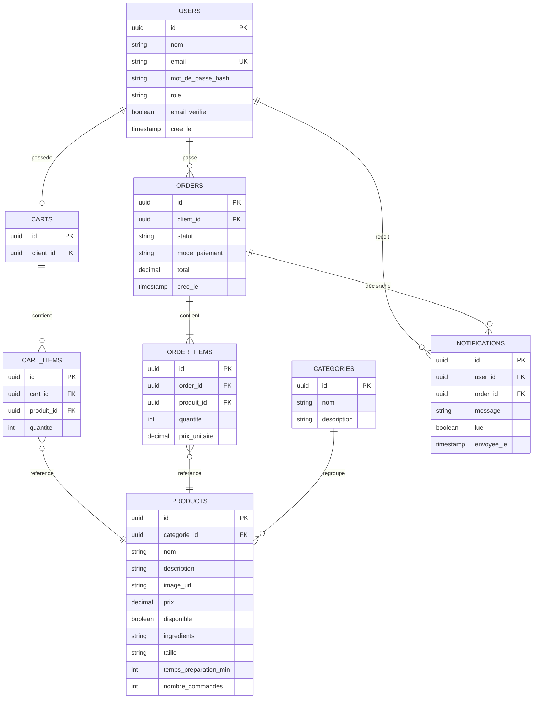

# Base de Données — Fati's Corner

**Phase 7 — Base de données (PostgreSQL / Neon)**
**Version :** 1.0
**Auteur :** Fatima
**Date :** Juillet 2026

Ce schéma traduit directement le diagramme de classes de la Phase 5 en tables relationnelles.

---

## 1. Modèle relationnel (ERD)



## 2. Détail des tables

### `users`
| Colonne | Type | Contraintes |
|---|---|---|
| id | UUID | PK, défaut `gen_random_uuid()` |
| nom | VARCHAR(100) | NOT NULL |
| email | VARCHAR(150) | NOT NULL, UNIQUE |
| mot_de_passe_hash | VARCHAR(255) | NOT NULL |
| role | VARCHAR(20) | NOT NULL, CHECK IN ('CLIENT','EMPLOYE','ADMIN') |
| email_verifie | BOOLEAN | NOT NULL, défaut `false` |
| cree_le | TIMESTAMP | NOT NULL, défaut `now()` |

### `categories`
| Colonne | Type | Contraintes |
|---|---|---|
| id | UUID | PK |
| nom | VARCHAR(50) | NOT NULL, UNIQUE |
| description | TEXT | |

### `products`
| Colonne | Type | Contraintes |
|---|---|---|
| id | UUID | PK |
| categorie_id | UUID | FK → categories(id), NOT NULL |
| nom | VARCHAR(100) | NOT NULL |
| description | TEXT | |
| image_url | VARCHAR(500) | (URL Cloudinary) |
| prix | DECIMAL(10,2) | NOT NULL, CHECK (prix >= 0) |
| disponible | BOOLEAN | NOT NULL, défaut `true` |
| ingredients | TEXT | |
| taille | VARCHAR(30) | |
| temps_preparation_min | INT | |
| nombre_commandes | INT | NOT NULL, défaut `0` (compteur pour « produits populaires ») |

### `carts`
| Colonne | Type | Contraintes |
|---|---|---|
| id | UUID | PK |
| client_id | UUID | FK → users(id), UNIQUE, NOT NULL |

### `cart_items`
| Colonne | Type | Contraintes |
|---|---|---|
| id | UUID | PK |
| cart_id | UUID | FK → carts(id), NOT NULL |
| produit_id | UUID | FK → products(id), NOT NULL |
| quantite | INT | NOT NULL, CHECK (quantite > 0) |

### `orders`
| Colonne | Type | Contraintes |
|---|---|---|
| id | UUID | PK |
| client_id | UUID | FK → users(id), NOT NULL |
| statut | VARCHAR(20) | NOT NULL, CHECK IN ('EN_ATTENTE','CONFIRMEE','EN_PREPARATION','PRETE','LIVREE','ANNULEE') |
| mode_paiement | VARCHAR(30) | NOT NULL, CHECK IN ('ESPECES','A_LA_LIVRAISON','MOBILE_MONEY_BANKILY','MOBILE_MONEY_MASRVI') |
| total | DECIMAL(10,2) | NOT NULL, CHECK (total >= 0) |
| cree_le | TIMESTAMP | NOT NULL, défaut `now()` |

### `order_items`
| Colonne | Type | Contraintes |
|---|---|---|
| id | UUID | PK |
| order_id | UUID | FK → orders(id), NOT NULL |
| produit_id | UUID | FK → products(id), NOT NULL |
| quantite | INT | NOT NULL, CHECK (quantite > 0) |
| prix_unitaire | DECIMAL(10,2) | NOT NULL (copie du prix au moment de la commande, pour l'historique) |

### `notifications`
| Colonne | Type | Contraintes |
|---|---|---|
| id | UUID | PK |
| user_id | UUID | FK → users(id), NOT NULL |
| order_id | UUID | FK → orders(id), NULLABLE |
| message | VARCHAR(255) | NOT NULL |
| lue | BOOLEAN | NOT NULL, défaut `false` |
| envoyee_le | TIMESTAMP | NOT NULL, défaut `now()` |

## 3. Index recommandés

```sql
CREATE INDEX idx_products_categorie ON products(categorie_id);
CREATE INDEX idx_products_disponible ON products(disponible);
CREATE INDEX idx_orders_client ON orders(client_id);
CREATE INDEX idx_orders_statut ON orders(statut);
CREATE INDEX idx_notifications_user ON notifications(user_id, lue);
```

Ces index accélèrent les requêtes les plus fréquentes : filtrage du menu par catégorie/disponibilité, liste des commandes d'un client, commandes du jour par statut (dashboard admin et écran employé), notifications non lues.

## 4. Notes de mise en œuvre

- Migrations gérées avec des scripts SQL versionnés dans `database/migrations/` (ex : `V1__init_schema.sql`, `V2__add_notifications.sql`), compatibles Flyway si tu veux l'automatiser plus tard.
- `mode_paiement` inclut déjà les valeurs Bankily/Masrvi en base pour anticiper l'intégration future, même si le MVP ne traite que `ESPECES` et `A_LA_LIVRAISON` côté logique métier.
- `nombre_commandes` sur `products` est incrémenté à chaque commande validée — évite un `COUNT()` coûteux pour la section « produits populaires » du menu et du dashboard.

---

*Ce schéma est directement exploitable pour la Phase 8 (API REST) : chaque table correspond à une ressource, chaque relation à un endpoint imbriqué ou un paramètre de filtre.*
